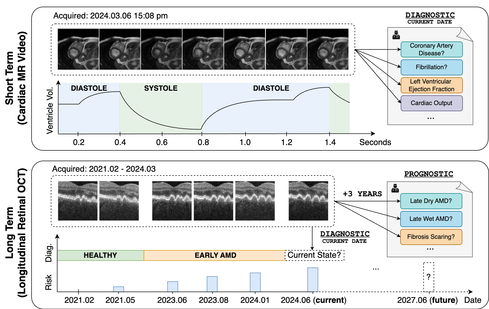
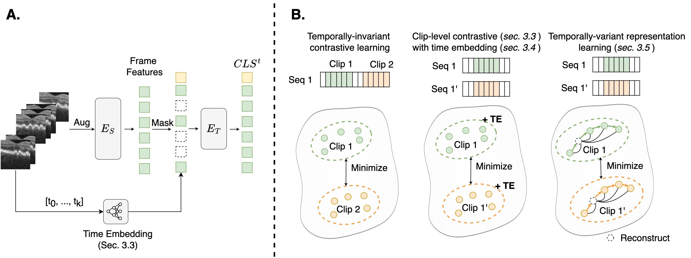

# Spatiotemporal Representation Learning for Short and Long Medical Image Time Series (MICCAI 2024)
Implmentation of "[Spatiotemporal Representation Learning for Short and Long Medical Image Time Series](https://arxiv.org/abs/2403.07513)" accepted at MICCAI 2024. Please do not hesitate to contact us if you have any questions.




## Contributions


- We demonstrate that, while established strategies for representation learning in natural videos perform adequately on short cardiac videos, they are especially poor at modeling long-range developments in longitudinal retinal images due to the neglecting of temporally variant features.
- We then propose a simple clip-level contrastive learning strategy that uses a single clip with time embedding to encode varying time intervals, outperforming all natural video baselines.
- Finally, we propose a novel method that combines the efficacy of clip-level contrastive learning with a frame-level latent feature prediction task. Our method outperforms all natural video baselines in cardiac output estimation and three prognostic tasks for late stage AMD.


## Environment Setup
```
conda create -n tvrl python=3.9 -y
conda activate tvrl
pip install -r requirements.txt
```

## Usage
### Data Preparation
For privacy reasons, we cannot provide the medical dataset used in the paper. In general, the dataset should contain a dir of images/videos and a csv file. 

### Pretraining
The entry point for pretraining is `pretrain.py`. To reimplement the pretraining methods in the paper, the following configurations can be used.

- CVRL: `pretrain_framework=simclr data=cardiac_2c8f2s_ssl`
- LTN: `pretrain_framework=simclr data=cardiac_1c8f2s_ssl use_ltn=True`
- MAE: `pretrain_framework=mae data=cardiac_1c8f2s_ssl`
- cSimCLR: `pretrain_framework=simclr data=cardiac_1c8f2s_ssl`
- cSimCLR-TE: `pretrain_framework=simclr data=cardiac_1c8f2s_ssl use_time_embed=True`
- TVRL: `pretrain_framework=mlm data=cardiac_1c8f2s_ssl`


Note that you will need to adjust the configuration file `config/pretrain.yaml`, before running the following command.
```
python pretrain.py --config-name=pretrain pretrain_framework=simclr data=cardiac_1c8f2s_ssl
```

### Linear Probing
We leverage standard linear probing to evaluate the model. The entry point for linear evaluation is `finetune.py`. By default, the script loads and freezes the checkpoint and runs with 5 random seeds to report the average performance with standard deviation. 

Note that you will need to adjust the configuration file `config/finetune.yaml` before runnig the following command.

```
# cardiac
pretrained_weights=/your/path/to/checkpoints/last.ckpt
python finetune.py pretrained_weights=$pretrained_weights data=cardiac_1c8f2s_sup

# retinal oct
pretrained_weights=/your/path/to/checkpoints/last.ckpt
python finetune.py pretrained_weights=$pretrained_weights data=oct_1c8f2s_sup
```

### Sample Script for Pretraining and Finetuning
We also provide a sample bash script at `scripts/cardiac.sh` with all the pretraining and finetuning commands for the cardiac dataset. Feel free to customize the script according to your needs.

## Additional Features
### Config management with [Hydra](https://hydra.cc/docs/intro/)
We use [Hydra](https://hydra.cc/docs/intro/) for configuration management. You can override the default configuration by passing the arguments in the command line. For example, to change the batch size, you can add `batch_size=64` to the command line.
```
python pretrain.py --config-name=pretrain pretrain_framework=simclr data=cardiac_1c8f2s_ssl batch_size=64
```

### Hyperparameter Tunning with Wandb Sweep
Wandb sweep can be used to run multiple experiments with different hyperparameters. Please check the [official documentation](https://docs.wandb.ai/guides/sweeps) for more details. We also provide a sample sweep configuration file `sweep/sweep.yaml`.


## Citing our work
If our work has contributed to your research, we would greatly appreciate an acknowledgement by citing us as follows:
```
@article{shen2024spatiotemporal,
  title={Spatiotemporal Representation Learning for Short and Long Medical Image Time Series},
  author={Shen, Chengzhi and Menten, Martin J and Bogunovi{\'c}, Hrvoje and Schmidt-Erfurth, Ursula and Scholl, Hendrik and Sivaprasad, Sobha and Lotery, Andrew and Rueckert, Daniel and Hager, Paul and Holland, Robbie},
  journal={arXiv preprint arXiv:2403.07513},
  year={2024}
}

```